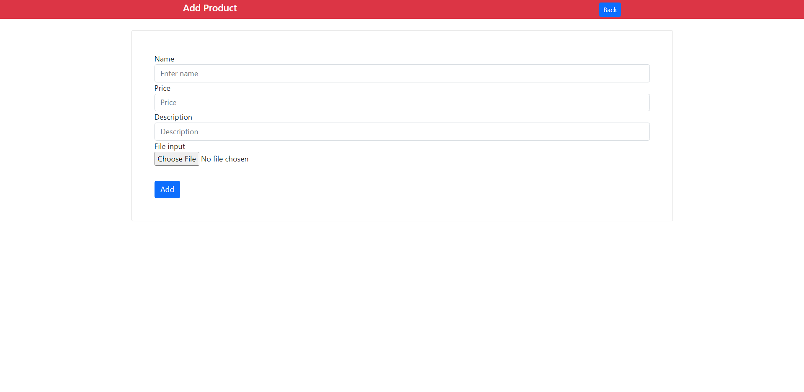

## About Laravel CRUD App

This is a laravel 8 crud app with a bunch of validations. This repository is all about product CRUD and laravel jetstream.

## How to install and run on your local system

- git clone https://github.com/shohan-ch/laravel-8-crud.git
- create a database with the name "crud"
- php artisan migrate
- php artisan serve (if the server opens up, http://127.0.0.1:8000, then we are good to go)
- And finally go to this uri (http://127.0.0.1:8000/product/)

## License

The Laravel framework is open-sourced software licensed under the [MIT license](https://opensource.org/licenses/MIT).
